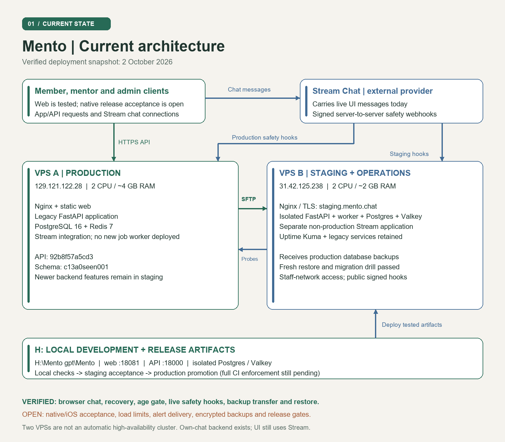
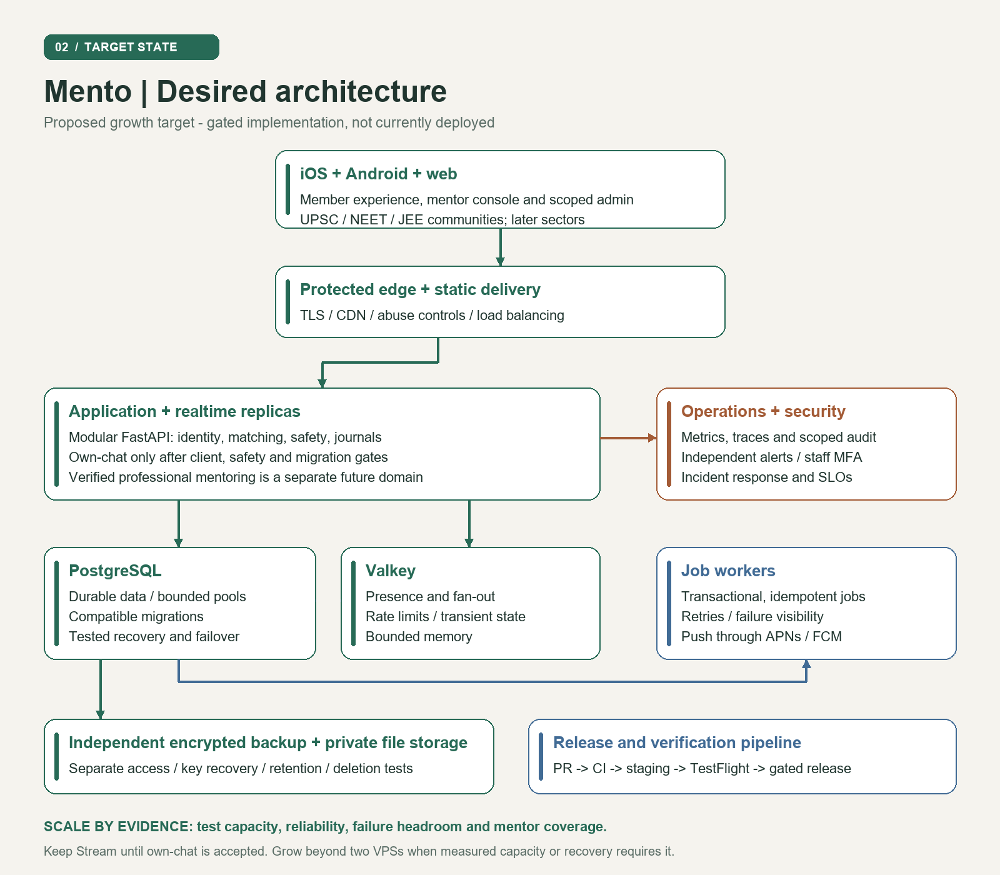

# Mento

An anonymous, low-friction emotional-support application with a shared onboarding base for members and mentors. The current v1 is 18+ anonymous support. UPSC, NEET and JEE are the community direction; verified professional mentoring, payments and broader sectors require their own agreed scope.

**Start here:** [Operations cookbook](docs/mento-cookbook.html) · [Current progress](PROGRESS.md) · [Product decisions](docs/DECISIONS.md) · [Release procedures](docs/RELEASE_PIPELINES.md)

## Verified status — 3 October 2026

- Expo 54 and 55 upgrade PRs #11 and #12 merged after successful Android send/reply checks. Current mobile source uses **Expo 55 / React Native 0.83.10**.
- Release foundation PR #13 introduces separate API/Test CI, staging acceptance and gated production promotion. At `f870d97`, API, web and release-tooling checks passed; native validation was still running when this snapshot was written. The latest native run subsequently failed at composer-send; PR #13 remains blocked. Check GitHub before releasing.
- VPS staging runs API/worker source `551345c`, with separate Postgres/Valkey and non-production Stream credentials. Browser chat, age gate, recovery, signed safety hooks and isolated backup restoration passed. Corrupted artifacts were rejected and deliberate startup failure rolled back successfully.
- Production application remains on the older deployment. Its API is healthy, but no new job worker is running and the crisis-webhook freshness probe is stale. Production promotion is disabled.
- Remaining: full CI-driven staging rehearsal, production operational gates, dependency security findings, load/device acceptance and iOS/App Store readiness. Passing tests are not an enterprise launch certification.

## Architecture

The original **Balanced Architecture Book** remains the baseline. See the [book-to-implementation crosswalk](docs/ARCHITECTURE_BOOK_ALIGNMENT.md) for exact decisions, current gaps and the later two-VPS additions.

[Current architecture image](docs/diagrams/mento-current-architecture.png) · [Target architecture image](docs/diagrams/mento-desired-architecture.png)



The diagram is the **2 October topology snapshot**. Android acceptance and release tooling have progressed since it was drawn; the status above and `PROGRESS.md` record that delta. The current UI uses Stream Chat; an own-chat backend is not a completed UI migration.



The target is a design, not the deployed state. See the [architecture audit](docs/ARCHITECTURE_REVIEW_2026-10-02.md) and [enterprise plan](docs/ENTERPRISE_PLATFORM_PLAN_2026-10-02.md) for evidence, stages and unresolved decisions.

## Environments and connections

| Environment | Address | Actual role |
|---|---|---|
| Development | `H:\Mento gpt\Mento`; web `18081`, API `18000` | Local development; isolated Docker Postgres `15432` and Valkey `16379` |
| Production / VPS A | `129.121.122.28` | Nginx, static web, older FastAPI, self-hosted Postgres 16 and Redis 7; about 4 GB RAM / 2 CPU |
| Staging + operations / VPS B | `31.42.125.238` | Restricted `staging.mento.chat`, API/worker, isolated Postgres/Valkey, Uptime Kuma, off-box backups; about 2 GB RAM / 2 CPU |
| Chat transport | Stream Chat | Clients connect to Stream; signed server-to-server hooks enforce safety on the API |

B's former IP was `87.232.72.79`; it is not the current connection address. Production backups transfer from A to B over pinned SFTP. These two servers are **not** an automatic failover cluster. Independent monitoring and encrypted recovery storage remain target improvements. See [environment ownership](docs/ENVIRONMENTS.md).

## Repository map

```text
apps/mobile/          Expo Router app: onboarding, member/mentor chat, journals, staff UI
  components/         UI, motion, onboarding and chat components
  lib/                API client, identity/session and domain helpers
  e2e/                Browser flows and Maestro native tests
services/api/         FastAPI, SQLAlchemy 2, Alembic, jobs and pytest
scripts/local/        H-workspace launchers and isolated test database
scripts/ci/           Exact-commit release policy and archive tests
deploy/               Compose, SSH access, receiver, staging and recovery scripts
.github/workflows/    API CI, Test CI, Maestro, Staging Release, Production Release
docs/                 Decisions, architecture, enterprise plan, diagrams and cookbook
PROGRESS.md           Dated evidence, open work and resume instructions
```

## Local development

Use only the H: checkout. Prerequisites: Node 22 (CI parity), npm, Python 3.12+, PowerShell 7 and Docker Desktop. If dependencies are not installed, create `services/api/.venv`, install `services/api/requirements-dev.txt` into it, and run `npm ci` in `apps/mobile`. Never copy production secrets into a development configuration.

```powershell
Set-Location 'H:\Mento gpt\Mento'
pwsh -File scripts/local/workspace.ps1 init
# Run each service in its own terminal, from the same folder:
pwsh -File scripts/local/workspace.ps1 api
pwsh -File scripts/local/workspace.ps1 worker
pwsh -File scripts/local/workspace.ps1 web
```

Open <http://localhost:18081>. These wrappers ignore copied application `.env` files, use `mento_dev`, and run tests against `mento_test`. Local push is disabled. The opt-in `.local/stream.env` is ignored by Git; its non-production Stream app currently points at staging hooks. Do not repoint those hooks or run simultaneous independent local live-chat tests against it. Use hermetic tests or a separate development Stream application.

## Verify a change

```powershell
# From repository root:
pwsh -File scripts/local/workspace.ps1 status
pwsh -File scripts/local/workspace.ps1 check
pwsh -File scripts/local/workspace.ps1 test
.\services\api\.venv\Scripts\python.exe -m unittest discover -s scripts/ci -p 'test_*.py'
# From apps/mobile:
npx tsc --noEmit
npm run test:route
npm run test:question
npm run test:placement
npm run test:bubble
```

Browser acceptance runs at 390 × 844, normally and with reduced motion, with zero page errors. Native CI verifies sent messages and mentor replies on an Android emulator. iOS physical-device/TestFlight acceptance remains separate. Use the isolated test wrapper instead of running raw pytest against a development or production database.

## Release and recovery

1. Develop locally, verify touched layers, and open/review a PR.
2. Merge only with current successful checks; then require successful **master-push checks for the exact SHA**.
3. Run Staging Release: build once, checksum, deploy, migrate, verify safety/restore/browser behavior, and publish the accepted candidate.
4. Complete the production checklist before enabling promotion. Production Release reuses that accepted candidate without rebuilding.
5. Observe errors, latency, worker backlog and saturation before expanding exposure.

The full commands, retry-artifact rules, SSH restrictions and rollback limitations are in [RELEASE_PIPELINES.md](docs/RELEASE_PIPELINES.md) and the [cookbook](docs/mento-cookbook.html). Database migrations must remain backward-compatible: runtime rollback does not automatically reverse schema changes. Legacy automatic production workflows are disabled.

## Safety and configuration

Never commit `.env`, private keys, tokens or user/message data. `EXPO_PUBLIC_*` variables are bundled into the client and cannot hold secrets. API role keys and Stream server credentials stay server-side. Read package `.env.example` files for configuration and `CLAUDE.md` for implementation conventions.

Preserve anonymity, 18+ age gating, crisis enforcement, honest payment states, deletion semantics and PII minimization. Keep a single shared onboarding base; do not infer a new bureaucrat-specific onboarding flow. Product decisions are authoritative over older PRDs and mockups.

## Working references

- [Cookbook](docs/mento-cookbook.html): start, verify, inspect, release, recover and troubleshoot.
- [Decisions](docs/DECISIONS.md), [PRD](docs/PRD.md), [project brief](CLAUDE.md).
- [Release pipeline contract](docs/RELEASE_PIPELINES.md), [staging operations](deploy/staging/README.md).
- [Enterprise and iOS roadmap](docs/ENTERPRISE_PLATFORM_PLAN_2026-10-02.md).
- [Progress and handoff](PROGRESS.md): dated facts; verify live state before acting.