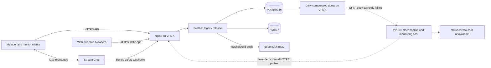
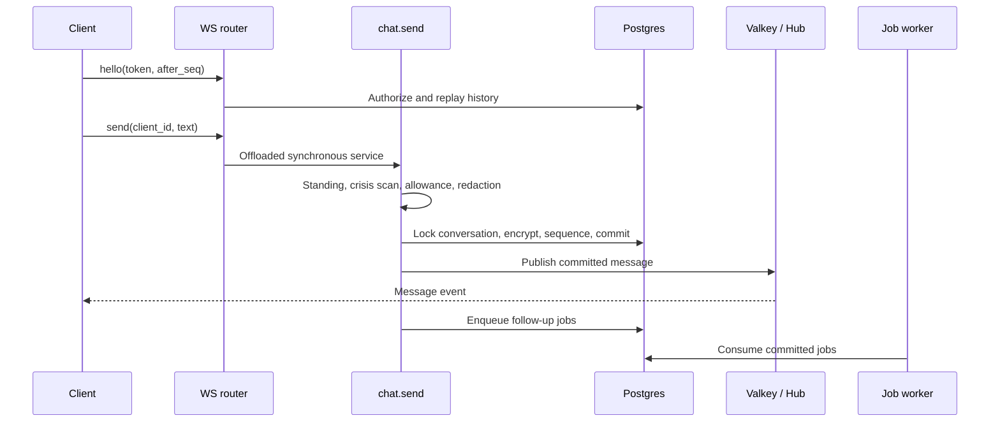
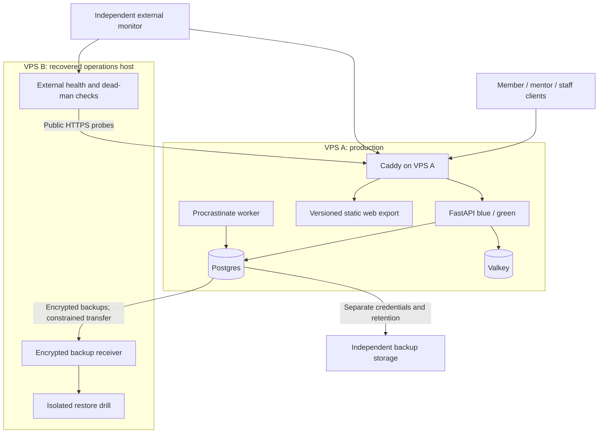

# Mento: current architecture, production audit, and extension plan

Reviewed 2 October 2026, Asia/Kolkata. This is an evidence-based review and proposed plan, not a deployment or a change to product scope.

Expanded roadmap: `docs/ENTERPRISE_PLATFORM_PLAN_2026-10-02.md` covers professional
delivery workflows, iOS/App Store eligibility and release, verified mentoring,
capacity benchmarks, staffing-dependent estimates and the Claude audit handoff.
It complements this deployment audit; proposed capabilities are not deployed facts.

## Execution update — verified VPS staging, 2 October 2026

This review remains the implementation baseline. All source changes are exclusively
in `H:\Mento gpt\Mento`; Desktop is untouched. Historical audit findings below are
preserved as the initial snapshot; this update records changes since that audit.

- **VPS B:** 31.42.125.238, strict SSH validation against its existing host identity.
  Debian 12, 2 CPUs, 1,918 MiB RAM, 30 GiB disk. Status DNS is corrected and HTTPS
  returns the monitoring dashboard redirect. Existing monitoring/legacy services remain.
- **Staging deployed:** https://staging.mento.chat, valid TLS, operator-network-only
  app/API access, public signed webhook routes and readiness. Dedicated Compose
  project/database/cache/secrets; push disabled. API/worker/Postgres/Valkey have
  resource caps. Production-like ENV=staging and migration-first startup are enforced.
- **Artifacts:** API 6e47f7a; web dc8d17c fixes recovery navigation's Lottie teardown
  error. Exact image ID and web archive hash: `deploy/staging/release.json`.
- **Acceptance:** live two-party browser chat passed normal/reduced motion with zero
  page errors. Corrected web recovery and age-gate checks also passed both motion modes.
  Live server-to-Stream safety bypass test proved crisis augmentation,
  one deduplicated signal flag and benign pass-through. Unsigned hooks return 401;
  app access from a non-allowlisted host returns 403; readiness returns 200. Local
  API baseline remains 708 passing tests; no API source was changed in this deployment.
- **Recovery restored:** production rclone now uses the new IP and pinned trusted
  host keys; transfer succeeded and an empty trust file was rejected. A fresh dump's
  hashes matched on A/B. It restored in a network-isolated disposable container and
  migrated from c13a0seen001 to e5a6part0001. Restore container/data volume removed;
  production data was never attached to the staging app.
- **Operational limits:** this initial staging uses existing host Nginx; Caddy and
  blue/green remain a later rehearsal. The development Stream app is assigned to
  staging; simultaneous live local Stream acceptance needs a separate app. Existing
  backup archives are not encrypted at rest. Native acceptance, push, erasure,
  reconnect/load, alert-delivery and broader backup hardening gates remain open.
  Production application deployment has not changed; only its backup routing/trust
  configuration was repaired.

Runbook: `deploy/staging/README.md`. Environment contract: `docs/ENVIRONMENTS.md`.
Access: `ssh -F deploy/ssh.config mento-staging` / `mento-production`.

## 1. Executive assessment

Mento already has a substantial anonymous emotional-support product: member onboarding, matching, real human chat, mentor recruitment and consoles, journals, safety interventions, moderation, and an admin dashboard. The central problem is the gap between three different states: the production release, the newer repository, and the intended Balanced architecture.

At the initial audit, production was reachable and lightly loaded, but recovery was degraded: the second server's recorded address was unreachable, off-site backup transfers had failed, and public status was unavailable. The execution update above records its recovered address; stale DNS and backup routing still need repair. A successful API health check does not establish that crisis enforcement, notifications, or recovery work end to end.

**Recommended direction:** keep the application a modular monolith; finish and verify the Balanced platform; recover the second VPS as an independent operations and recovery host; add a separately protected backup destination; migrate chat only after client, safety, deletion, and failure tests pass. Two VPSs do not currently constitute a high-availability cluster.

The review made no production changes, sent no test messages to users, and read no user message bodies or secret values. It inspected source, deployment metadata, service inventory, selected host settings, backup logs, public endpoints, and CI status. The older server could not be inspected internally.

## 2. Evidence and authority

| Evidence | What it establishes |
|---|---|
| `CLAUDE.md`, `docs/DECISIONS.md`, `docs/PRD.md`, `PROGRESS.md` | Product constraints, intended behavior, and historical progress; DECISIONS wins on product conflicts |
| Local branch `feat/ws6-t6.2-step3-expo55`, starting SHA `9cdf917f96c812ba068a122c15063726c47c749e` | Code inspected during this review; a development branch, not a release certification |
| Production SSH, `docker ps`, Git SHA, Alembic revision, host configuration | Actual deployed infrastructure and backend revision |
| Public HTTPS requests and DNS | Reachability and advertised health at review time |
| GitHub Actions metadata | Native CI for the inspected commit failed at the emulator-flow step |
| Balanced design spec and program plan dated 2026-09-20 | Target architecture and existing workstream IDs, not evidence of deployment |
| `H:\Mento gpt\Mento-Architecture-Book.html` | Useful September 20 design narrative; SHA-256 comparison confirmed it is byte-identical to the untracked repository-root copy |

The book's high- and low-level discussions are useful foundations. Keep its product framing, dependency maps, budget alternatives, and phased rollout thinking. Treat statements such as 500–750 live chats, recovery in 45 minutes, free-service thresholds, prices, and one-week implementation estimates as historical assumptions requiring new evidence. This review does not certify legal or store compliance or repeat those estimates as facts.

## 3. Folder structure and responsibilities

```text
Mento/
  AGENTS.md, CLAUDE.md          working contract and project memory
  PROGRESS.md                  session history and resume instructions
  apps/mobile/                 one Expo project: member, mentor, web admin
    app/                       Expo Router routes and layouts
    components/
      onboarding/              persistent journey and step machine
      chat/                    member chat, composer, controls, crisis card
      mentor/, listener/       mentor app and web-console surfaces
      admin/                   web-only staff dashboard and panels
      art/, motion/            companion art and motion primitives
    lib/                       API clients, sessions, Stream adapters, navigation
    theme/, locales/           design tokens and EN/HI text
    assets/, public/           native/shared media and web entry assets
    e2e/                       browser specs, Node checks, Maestro native flows
    patches/                   dependency compatibility patches
    app.json, app.config.ts    base config and production-specific overrides
  services/api/
    app/routers/               HTTP/WS transport, authentication dependencies
    app/services/              matching, safety, chat, erasure, push, identity
    app/models/                SQLAlchemy entities and constraints
    app/jobs/                  durable job queue, tasks, retention, worker
    app/chat_hub.py            cross-process realtime fan-out and presence
    migrations/                Alembic revisions and vendored job schema
    tests/                     backend contract, concurrency, lifecycle tests
    scripts/                   seeders and administrative commands
  deploy/
    docker-compose.prod.yml    legacy stack, actually live
    compose.base/local/prod    Balanced stack, available in source
    nginx/, caddy/             legacy and target edge configurations
    deploy.sh, bluegreen.sh    migrations, releases, rollback, color swaps
    deploy-web.sh              separate static web deployment
    backup-postgres.sh         dump and SFTP copy to older server
    external-monitor.sh        monitor intended to run on older server
    domains.env                deployed hostname/SSH configuration
    secrets/                   encrypted production config in newer source
  .github/workflows/           backend CI, native CI, API/web deployment
  scripts/lanes/               local verification and release orchestration
  docs/                       decisions, requirements, audits, specs, plans
  Mento-Architecture-Book.html  pre-existing untracked reference artifact
```

Local `node_modules`, `.venv`, caches, `dist`, `.env` files, and development databases are working artifacts, not separate services. Their presence must not be interpreted as deployed functionality.

**Structure assessment:** the main boundaries are sensible. There is no immediate reason to split into microservices or separate repositories. The greatest maintenance cost is duplicate state documentation and simultaneous legacy/target deploy paths. Keep both deploy paths until the migration is proven, then archive the obsolete runbook. Add a compact release manifest describing backend SHA, web SHA, mobile runtime/build, schema revision, stack mode, and last restore drill. Separate historical narrative from the current operational inventory.

## 4. What has been built, versus what is live

| Capability | Repository state | Production evidence / qualification |
|---|---|---|
| Anonymous age-gated onboarding, personas, companions, EN/HI | Built | Earlier implementation is in live release; no full user-flow test in this review |
| General matching and Personal requests | Built; Postgres locking protects assignment | Live backend has matching and listener/request tables |
| Member and mentor text chat | Stream clients remain | Live backend uses Stream; no own-chat tables or router in live checkout |
| Chat controls, journals, reflection, reports, links, feedback | Built | Corresponding legacy routes/tables present; individual flows not re-certified |
| Mentor application and admin approval | Built | `/apply` returns HTTP 200; this verifies route serving, not form completion |
| Admin dashboard and audited safety access | Built; newer source further restricts conversation reads | Admin host returns 200; do not assume newer restrictions are deployed |
| Rotating refresh tokens, recovery codes, member standing | Built in newer source | Live schema has no `sessions`/console-code tables; live router list has no `auth.py` |
| Stronger foreign keys, export, data-request register | Built in newer source | Live schema/revision predates this work |
| Procrastinate job queue and worker | Built in newer source | Not deployed: no worker container, job package, or job tables |
| Own-chat WS/history, encrypted bodies, partitions | Server groundwork built | No client cutover; absent from live backend |
| Balanced Compose, Caddy, Valkey, blue/green, GlitchTip | Config/scripts exist | Not running on production |
| SOPS/age production configuration | Present in newer source | Live checkout uses a mode-600 plaintext `.env`; encrypted file not present at checked path |
| Push | Expo relay integration exists; newer code uses jobs | Old production code uses in-process background tasks; absence of a worker does not prove old pushes are broken |
| Payments, AI journal sorting, analytics/error integrations | Partial or environment-gated | Activation and vendor delivery not audited; do not label them enabled |
| EAS Update | Configured in current app source, preview channel | Installed APK/OTA runtime compatibility not inspected |

The checked branch declares Expo 55, React Native 0.83.10, React 19.2, Reanimated 4.6, Skia 2.4.18, and TypeScript 5.9.2. `CLAUDE.md` still describes Expo 52/RN 0.76. The branch is an upgrade in progress: [its native CI run failed](https://github.com/trendywink247-afk/mento-app/actions/runs/36916149922) in “Run the two flows on a real emulator.” This review did not diagnose that failure or rerun tests.

Newer backend source pins FastAPI 0.141.1 and SQLAlchemy 2.0.54 and uses synchronous SQLAlchemy sessions. FastAPI's async transport does not make database access automatically asynchronous; own-chat explicitly offloads synchronous database work to a thread.

## 5. Production server: directly observed

| Item | Observed value |
|---|---|
| Host | `mento-prod-1`, `129.121.122.28` |
| Access | `mento-ops`, existing local SSH identity `~/.ssh/mento_prod_agent`, host-key checking enabled |
| OS | `/etc/os-release` reports Ubuntu 26.04.1 LTS |
| CPU / RAM | 2 logical CPUs; 3,909 MiB RAM, approximately 2,983 MiB available at first sample |
| Swap / root disk | 2,047 MiB swap, unused; root filesystem 96 GiB, 6.8 GiB used, 90 GiB available |
| Load / uptime | Load about 0.13; uptime about seven days; a snapshot, not a capacity benchmark |
| Edge | Host Nginx active; Caddy inactive; certbot timer present |
| Backend | `mento-api-prod`, `mento-api:92b8f57a5cd3`, healthy; host bind `127.0.0.1:8000` |
| Data | `mento-postgres-prod`, Postgres 16; `mento-redis-prod`, Redis 7; neither database port published on host |
| Backend checkout SHA | `92b8f57a5cd30602c27487e046b92162e7528687` |
| Schema revision | `c13a0seen001` |
| Running containers | Exactly the API, Postgres, Redis at inspection; no stopped worker or Balanced service found |
| Actual API dependencies | FastAPI 0.115.6; SQLAlchemy 2.0.36; no Procrastinate requirement |
| Memory limits / sample use | API 384 MiB / 226 MiB; Postgres 256 MiB / 37 MiB; Redis 128 MiB / 3.7 MiB |
| Web root | `/opt/mento-console/current`, an actual directory at inspection; frontend SHA not established |
| Host ports | Public TCP 22/80/443; API on loopback; no public 5432/6379 listener observed |
| Firewall / SSH | UFW active; effective sshd settings include `PermitRootLogin yes`, `PasswordAuthentication yes` |
| Backup / monitoring cron | Backup at 03:00 UTC daily (08:30 IST); local health check every five minutes |

Provider, billing, physical region, failure-domain independence, provider firewall, and recovery-console access were not established by these commands. In particular, the book's “India” target is not evidence that this host is physically in India.

The local starting branch contains 102 commits not reachable from the deployed SHA. That is a Git graph comparison, not 102 production-ready changes. Deploying the current branch wholesale would mix a mobile diagnostic branch with substantial backend/schema changes.

### Public reachability

| Endpoint | Result |
|---|---|
| `https://api.mento.chat/api/v1/health` | 200 |
| `https://api.mento.chat/api/v1/health/ready` | 200 |
| `https://api.mento.chat/api/v1/health/crisis` | 503, `stale` |
| `https://app.mento.chat/` | 200 |
| `https://app.mento.chat/apply` | 200 |
| `https://admin.mento.chat/admin` | 200 |
| `https://status.mento.chat/` | Connection timeout; DNS resolves to `87.232.72.79` |

The crisis endpoint's last recorded Stream webhook was **28 September 2026, 16:27:32 IST**. This is a freshness signal, not proof of scan failure: an idle application can legitimately become stale. Conversely, treating all HTTP 503 responses as acceptable hides real failures. The checked external-monitor script alerts only on connection failure for this endpoint, so HTTP 500 or a meaningful 503 would not page through that check.

## 6. The two-server connection, as it exists

The user confirmed these are the two servers. The older host `87.232.72.79` timed out on SSH from this machine and on a TCP-22 probe from production. Its historical Debian/1–2 GB specification is unverified today. A timeout does not tell us whether it is powered off, suspended, firewalled, or has a routing problem.



**VPS** means a virtual server. **VPC** means a private network. On VPS A, inspected interfaces/routes showed its public interface and local Docker bridges; no private inter-server interface/tunnel was observed. Repository scripts describe public-address SFTP and HTTPS monitoring, not VPC peering, database replication, or shared cluster storage. Provider-side networking remains unverified.

Backup evidence is unusually clear:

- Local dumps exist through October 1 at 03:00 UTC, approximately 5.5 KB each. Small size is not validation; no restore was run.
- The last successful off-site copy shown in the inspected log is September 29 at 03:00 UTC / 08:30 IST.
- September 30 and October 1 copies failed with SSH connection timeouts. October 2's scheduled backup was not yet due at inspection.
- rclone logs explicitly warn that host-key validation is disabled. That weakens server authentication during otherwise encrypted SFTP transfer.
- The backup script catches off-site failure, prints a warning, and can finish successfully. Monitoring needs a distinct last-off-site-success timestamp and a failure exit status.
- The script creates gzip-compressed SQL dumps; it does not encrypt their content at the application layer. SFTP transport encryption is separate from backup-at-rest protection. Disk encryption was not audited.
- Local retention is 14 days; off-site policy in the script is 30 days. Actual surviving files on B are unknown.

## 7. Low-level application design

### Domain and data boundaries

| Domain | Main records / responsibility | Boundary to preserve |
|---|---|---|
| Identity | users, listener profiles, newer sessions/recovery/console codes | Anonymous member identity, separate staff/mentor authority |
| Routing | conversations, requests, mentor links, matching | Row locks and transactional capacity accounting |
| Content | journals, reflection, feedback | Private content; feedback has its own minimization promises |
| Safety | flags, reports, member standing, audit | Signal-only flags; scoped and audited staff reads |
| Messaging | Stream today; newer messages/read markers | Exactly one server write path; replay from durable history |
| Operations | newer Procrastinate jobs, health, backups | Job durability and measurable recovery |

Core relationships are `User → Conversation ← ListenerProfile`, `Conversation → messages/read markers` after own-chat, and `User → journals/requests/links/sessions`. Newer migrations add explicit foreign-key rules. Erasure is an orchestrated service, not a raw `DELETE users`: it must clear external chat storage, free capacity, and preserve only the detached records allowed by decisions.

### Current live message path

1. Client authenticates anonymously to Mento, matches, and receives Stream access.
2. Stream receives text and invokes the signed before-send webhook.
3. Mento scans the original text for crisis, applies the applicable allowance, then redacts sensitive text; flags hold signals rather than message bodies.
4. Stream stores/delivers the message; clients render the crisis payload when present.
5. The asynchronous webhook can rescan missed events and schedule best-effort in-process push work.

The existing deliberate fail-open policy allows delivery during a scan outage. It therefore needs effective detection and response; it is not a guarantee that every delivered message was successfully scanned.

### Own-chat implementation present in source



Entry points: `app/routers/chat.py`, `app/services/chat.py`, `app/chat_hub.py`, `app/services/message_crypto.py`, and `app/jobs/retention.py`.

- WS endpoint `/api/v1/chat/ws/{conversation_id}` authenticates in its first frame, keeping bearer tokens out of URLs. History is available via REST after a sequence number.
- Message identity derives from conversation, sender, and client ID; the conversation lock serializes sequence allocation and duplicate handling.
- Bodies use AES-GCM with record identifiers as associated data. This is server-readable encryption at rest, not end-to-end encryption.
- Hub pub/sub distributes across processes; Postgres history is the durable recovery mechanism. A local-only fallback cannot maintain cross-process live delivery during Valkey failure; clients need a tested catch-up strategy even when a socket remains connected.
- Bounded queues, frame limits, idle deadlines, and socket limits protect resources. The three-socket limit is implemented within a process's per-conversation room, not proven to be a global account-wide limit across hosts.
- End/wipe events follow root commits. Own-chat Clean Wipe deletes bodies and read markers and ends the conversation.
- Monthly retention drops entire expired partitions; actual lifetime can exceed the configured number by about a month. Unset retention deletes nothing. A strict day-based policy needs additional deletion logic.
- Message persistence commits before fan-out and follow-up enqueue. Catch-up protects stored messages, but a crash in that gap can lose a live notification or push job. Before cutover, consider a transactional outbox for required delivery work and test crash recovery at these boundaries.

### Resource and deployment implications

The Balanced Postgres configuration caps connections at 50, while current source defaults to pool 10 plus overflow 10 **per API process**. Two processes in each of two overlapping deployment colors could demand 80 connections before workers or admin tools. Explicitly budget pools across all processes; reserve migration/operations slots and test the peak during a swap. Add a pooler only if measured concurrency justifies it.

Blue/green improves HTTP release availability on one host; it does not survive loss of that host. Existing sockets on a stopped color will disconnect. Prove graceful drain, reconnect, ordered replay, no duplicate messages, and no lost crisis metadata through a real deploy before describing chat deployment as seamless.

## 8. What Mento needs to become

The product should remain a fast, anonymous route to a real person, with mentor capacity and safe referral as operational commitments. Its next maturity step is a releasable, recoverable v1, not a broader feature catalogue.

Finish reliable member/mentor message delivery on physical Android devices; release-compatible recovery/auth; deletion that agrees with every storage location; offline journals; staff access controls; visible failure states; and measured latency, startup, accessibility, and crash performance. Retain the chosen companion, Clay and Sage tokens, no audio, reduced motion, and EN/HI support.

The intended platform is Caddy + FastAPI + Postgres + Valkey + Procrastinate, with own chat, controlled secrets, independent monitoring, and tested backups. Direct FCM, refined safety/admin tools, and privacy-conscious analytics belong to their existing workstreams. They should be activated with explicit release gates rather than bundled into one migration.

Module B paid mentoring, self-assessment, and Community remain future options. A comprehensive plan can describe them, but they still require separate product decisions and specs. Preserve v1 anonymity if later paid profiles are introduced; reuse routing and scheduling abstractions without exposing real identities in anonymous chat.

## 9. Recommended extension of the two VPSs

### Stage A: production plus independent operations and recovery



Keep A's request path self-contained at current scale. Recover B through the provider console first. Verify its actual RAM, disk, OS, keys, patching, and network before assigning workloads. Monitoring plus a backup receiver is suitable as its initial role; do not assume the historical small box can also run GlitchTip, staging, restore jobs, and a replica simultaneously.

Use an authenticated private tunnel if needed for operational services, with least-privilege peer rules and access to only required ports. Keep external availability probes on the public route to exercise DNS/TLS/edge behavior. A tunnel is not a substitute for separate application credentials or safe firewall configuration.

Backup transfer should use a dedicated restricted account, verified host keys, encrypted archives, checksums, bounded timeouts, and explicit last-success metadata. Separate the authority to write new backups from authority to prune history where possible: a compromised production key should not erase every recovery copy. Add independent storage after evaluating location and access requirements; the second VPS alone still shares operational risks with A.

Proposed initial recovery objectives, requiring founder adoption and drill evidence: **RPO ≤6 hours** for non-message application data and **RTO ≤2 hours** for a complete rebuild. These are targets, not current guarantees. Choose message-history recovery separately because backing up deleted conversations can contradict Clean Wipe.

### Stage B: recovery host to warm standby, if availability requires it

After B is stable and adequately sized, keep compatible application artifacts ready there and consider an asynchronous Postgres standby. Replication is not a backup: accidental deletes and corruption can propagate. WAL archives, snapshots, and replicas also contain message data and must obey the chosen deletion/retention policy.

Use **manual promotion initially**: confirm A is stopped or fenced, inspect replication lag and the data-loss window, promote B, point application dependencies at the promoted primary, verify safety and jobs, then move traffic. A two-node automatic election without an independent quorum/fencing mechanism risks split brain. Asynchronous replication can lose recent commits; synchronous replication can trade write availability for durability. These tradeoffs are documented in [PostgreSQL's standby guidance](https://www.postgresql.org/docs/16/warm-standby.html).

DNS switching is not instant failover. Record TTLs, stale clients, reconnection behavior, and the failback procedure. Do not claim zero data loss or zero downtime until a specific mechanism and drill demonstrate it.

### Stage C: scale by measured bottleneck

| Evidence | Extension |
|---|---|
| Persistent memory pressure or DB latency | Resize A first; tune queries, pools, and indexes using measurements |
| CPU saturation from independent jobs | Move workers to a suitable host over private authenticated networking; preserve queue correctness |
| Sustained realtime concurrency exceeds load-test envelope | Add API capacity behind an edge/load balancer; shared Postgres and Valkey; global abuse controls |
| Database becomes limiting or recovery burden grows | Dedicated/managed Postgres with verified backup, failover, region, and deletion policies |
| Static media bandwidth dominates | Static asset CDN/object storage with versioned immutable assets; keep private content separate |
| Multiple production hosts need orchestration | Introduce orchestration only when Compose deployment and operations become a measured constraint |

The architecture book's estimated simultaneous-chat capacity is not a sizing result for this server. Test realistic sockets, message rate, safety scans, database contention, reconnect storms, and deploy overlap, with latency and error budgets. Avoid adding heavyweight AI inference to A before memory/CPU and safety-evaluation evidence support it.

## 10. Priority findings and acceptance criteria

| Priority | Finding | Concrete action and completion evidence |
|---|---|---|
| P0 recovery | Off-site copy broken; B and status page unreachable | Recover via provider console; validate host identity, restore transfer and monitoring; retrieve and restore a newly transferred encrypted backup on an isolated instance |
| P0 safety assurance | Crisis health stale and monitor treats any HTTP reply as reachable | Verify configured webhooks read-only, then run an explicitly scoped synthetic safety drill; add independent heartbeat/error monitoring that distinguishes idle from failed scan; prove phone alert delivery |
| P1 security | Root login/password auth allowed in effective SSH settings | Verify alternate key login and provider rescue first; disable password/root login, validate sshd config, test a second session before closing the first |
| P1 security | Backup SFTP host-key verification disabled | Verify B's key out of band and pin it; prove wrong-key refusal. Follow [rclone host-key validation guidance](https://rclone.org/sftp/#host-key-validation) |
| P1 operations | Production is older than docs imply | Select a tested release SHA; record API/web/mobile/schema versions; do not deploy the diagnostic branch as a release |
| P1 release | New API assumes migrations, distinct secrets, and worker | Rehearse restore plus upgrade; validate required configuration without logging values; prove worker heartbeat, scheduling, restart/retry, rollback |
| P1 privacy | Backup script dumps everything, including future own-chat bodies | Adopt one deletion-compatible strategy; cover every partition and restore path; verify a wiped conversation cannot reappear after recovery |
| P1 mobile | Expo upgrade branch has failed native CI | Diagnose exact failing run; pass native onboarding, two-party chat, crisis, reconnect, and production-build checks before release |
| P1 capacity | Connection pools can exceed target Postgres cap during blue/green | Set an explicit total connection budget; load-test with both colors and worker alive |
| P2 detection | No deployed queue/error tracker; status shares backup-host outage | Deploy operational telemetry deliberately; add monitoring of B from a separate failure domain and alerts on missed backup/monitor heartbeats |
| P2 deployment | Frontend/backend ship separately; web SHA unknown | Add release manifest and compatibility checks; pair stable API release and web export; verify mobile backward compatibility |
| P2 documentation | Cutover claimed complete in one doc, “staged” in another | Replace current-state claims with dated inventory, preserve history, and tie completion to runtime evidence |

Docker's published ports need explicit review as well as UFW: Docker documents that published-container traffic can bypass UFW's usual path. The inspected database ports are not published; retain that boundary when introducing new services. See [Docker's firewall documentation](https://docs.docker.com/engine/network/packet-filtering-firewalls/).

## 11. Execution plan aligned to existing workstreams

1. **Restore operational trust — WS1/WS12.** Recover B, secure backup transport, verify external alerts, inventory both hosts, check provider region/rescue/billing, and create the release manifest. Exit: independently restorable backup plus observable failures, not just successful commands.
2. **Rehearse a supported backend release — WS1–WS4.** Use an isolated restored database and compatible release branch; provision role secrets/proxy settings; validate schema changes, legacy-token windows, job queue, and resource budgets. Exit: migration/rollback rehearsal and relevant API tests on isolated Postgres. Do not run truncating tests against production.
3. **Move to Balanced infrastructure — WS1.** Rehearse restore-before-migrate, Caddy host/TLS map, Valkey behavior, blue/green and worker lifecycle. Update the backup script's hard-coded legacy container target before retiring it. Exit: public health, message flow, jobs, backup and rollback evidence. Keep domain move and runtime migration as separate milestones.
4. **Finish the Android upgrade — WS6/WS11.** Resolve native CI failures, audit compatibility patches, verify release config and EAS runtime/channel handling. Exit: physical-device and emulator flow evidence plus size/startup measurements. `app.config.ts` overrides the base cleartext flag for production; audit the effective build, not `app.json` alone.
5. **Finish own chat before cutover — WS5/WS6/WS7/WS8.** Native and web consumers, push presence, scoped staff viewing, history/export/erasure, transaction-gap handling, retention, safety eval, load and chaos tests. Exit: one checked write path, no message loss/duplication across reconnect/deploy, deletion proof, and measured p95 targets.
6. **Controlled transport cutover — T5.10.** Choose a maintenance/cohort strategy, address installed older clients, stop new legacy conversations, settle/archive/delete remaining Stream data according to policy, then activate one authoritative transport. Avoid unplanned dual-write. Define rollback before new own-chat messages exist; restoring old code cannot magically move those messages into Stream.
7. **Launch readiness — WS9/WS10/WS11.** Staff permissions and training, published policies reflecting actual storage/access, privacy requests, incident runbooks, coverage hours, production alerts, and a closed pilot. Legal/store review remains an independent launch gate.
8. **Optional resilience and future modules.** Use measured downtime/capacity needs to choose standby, dedicated DB, or additional workers. Spec paid mentoring and other deferred modules independently.

These phases deliberately have evidence gates rather than speculative calendar promises. The unresolved native failure and inaccessible second host make a credible completion date premature.

## 12. Decisions and unresolved questions

- **Retention/deletion:** the design spec says exclude message bodies; the program plan suggests a short body-backup tier; PROGRESS says the choice remains open. Recommendation: exclude message bodies from long-lived backups until an explicit, implementable deletion policy is adopted. Include journal copies, WAL, replicas, and safety access in the analysis.
- **Region/provider:** verify both hosts and any future storage location through the provider account. Do not infer location from IP or an old purchase plan.
- **Resilience objective:** accept the proposed RPO/RTO or set alternatives; decide whether B is operations-only or must become a warm standby.
- **Own-chat key custody:** select who can recover/rotate message keys and where backups of keys live. SOPS manages configuration; it does not by itself solve message-key access control.
- **Staff access:** ratify visibility and two-person approval scope before expanding the admin safety desk.
- **Release baseline:** select a stable branch/commit after native and API gates pass. Current repository HEAD is not that decision.
- **Safety verification:** determine a synthetic test identity/channel and trained responder so live drills do not create confusing production alerts or involve real members.

## 13. Safe access and follow-up checklist

Existing production access works from this machine:

```powershell
ssh -o BatchMode=yes -o StrictHostKeyChecking=yes mento-ops@129.121.122.28
```

The matching command to `87.232.72.79` currently times out. Use the provider console to establish its condition before attempting access changes. Never work around an unexpected host-key change by disabling checking; verify a rebuilt host's identity through the provider.

For the next review, capture only operational metadata: host resources and routes; active listeners and containers; app/web/schema SHA; worker heartbeat; backup/restore timestamps; certificates; public probes; and CI links. Do not paste environment values, credentials, user records, or chat logs into the report.

No code tests were run for this documentation-only review. Public probes are not end-to-end product verification. Historical test counts in PROGRESS remain historical. The native CI failure is current evidence; the failure's root cause is not established here. The older host's internal state, off-site file integrity, production Stream configuration, and installed APK state remain unverified.

Resume from repository root: `Get-Content docs/ARCHITECTURE_REVIEW_2026-10-02.md`, then start phase 1 with the provider-console recovery of VPS B and an isolated restore drill.
