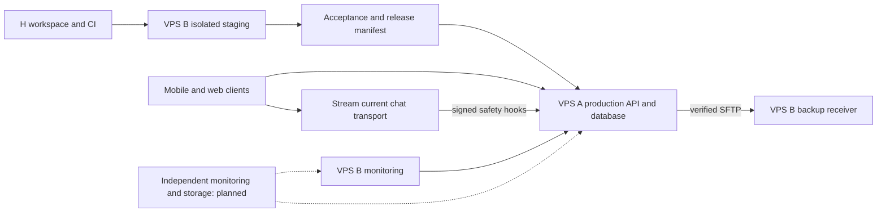
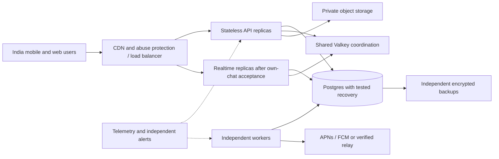

# Mento: enterprise readiness, iOS release and India-scale roadmap

Prepared 2 October 2026 against checkout 229b997 and the current architecture review. This is a proposed execution plan, not a certification, deployment, App Store approval or measured capacity claim. Work remains exclusively under `H:\Mento gpt`. “RV” was a dictation error for “are we”; there is no RV component to migrate.

## 1. Recommendation and current stage

Keep the modular monolith. Establish one controlled release pipeline, finish native and operational acceptance, and launch a staffed, bounded pilot. Expand infrastructure against measured demand. Develop verified professional mentoring only after its identity, service and governance requirements are explicit.

We are at **working local development plus controlled VPS staging**. Substantial backend and browser functionality exists. We have not established complete native acceptance, iOS distribution, high availability, store eligibility or national-scale capacity. A single percentage-complete figure would hide those different gates.

Enterprise readiness means measurable reliability, security, recoverability, accessibility, change control and staffed operations. It does not mean an unlimited user count, microservices by default, or Apple's Enterprise distribution programme. ISO 27001/SOC 2 certification would be a separate business programme if later required; none is claimed.

## 2. Product boundary and communities

Founder clarification: communities include UPSC, NEET and JEE; finance and other sectors may follow. Preserve the current community model and anonymous-support experience. A community is a discovery/context lens, not permission to expose identity or make regulated professional claims. NEET/JEE audiences may include minors, but the current product remains 18+; opening it to minors requires a separately designed programme.

The unresolved distinction is between:

- **An anonymous support mentor:** the existing persona-based relationship, with support/referral and no clinical claims.
- **A verified professional mentor:** a public real profile, demonstrated expertise, possibly scheduled sessions and compensation.

The second can serve the same communities, but requires different identity, permissions and operational controls. This plan does not replace the current product or silently activate paid Module B. Existing DECISIONS remains authoritative until a concrete expansion is ratified. No real-profile badge should reveal an anonymous mentor's identity or expose a mentee's past support conversations.

## 3. Older architecture, current evidence and next state

| Component | Earlier baseline or design | Current state | Next step |
|---|---|---|---|
| Product | Anonymous support first; specialization deferred | Onboarding, matching, member/mentor chat, journals, admin and moderation exist | Harden the core; specify professional mentoring separately |
| Mobile | Docs describe Expo 52/RN 0.76; September plan targeted newer SDKs | Package declares Expo 55, RN 0.83.10, React 19.2, Reanimated 4.6 and Skia 2.4.18 | Stabilize a supported, tested runtime; finish Android and iOS acceptance |
| Character design | Rive commission considered, then replaced | In-house rigs/painterly poses, Reanimated/Skia/Lottie | Preserve design system; profile rendering and accessibility rather than rewrite it |
| Chat | Stream in service; own-chat proposed | Stream still carries UI chat; own-chat server groundwork exists | Keep one authoritative transport per conversation; cut over only after full gates |
| Auth | Legacy long-lived tokens | Newer source/staging has rotating sessions, recovery and role secrets | Verify device lifecycle and privileged access; add staff MFA |
| Backend | FastAPI modular application | Prior local baseline: 708 tests passed; newer API on staging | Contracts, failure tests, migration compatibility and dependency budgets |
| Production A | Nginx/API/Postgres/Redis | 129.121.122.28; 2 CPU/~4 GB; API 92b8f57a5cd3 and schema c13a0seen001 at last audit | Promote accepted artifacts; rehearse worker and blue/green lifecycle |
| VPS B | Old IP 87.232.72.79, initially unreachable | Recovered at 31.42.125.238; 2 CPU/~2 GB; staging, backups, monitoring and legacy services | Preserve resource headroom; separate workloads as measured demand grows |
| Staging | Absent | Isolated API/worker/Postgres/Valkey, TLS, operator-network access | Reproducible CI deployment and independent vendor environments |
| Backup | Local gzip; failed off-site routing | Address/trust repaired; new transfer, checksum, restore and forward migration proven | Encryption, deletion-aware retention, separate authority and recurring drills |
| Edge | Nginx live; Balanced Caddy planned | Staging also uses existing Nginx | Rehearse Caddy/blue-green independently of mobile/chat migrations |
| Push | Expo relay; later direct-FCM design | Worker integration exists; staging push disabled | Real-device APNs/FCM lifecycle tests; controlled provider migration if justified |
| CI/release | Separate backend and web pipelines | API CI exists; web push deployment can bypass staging | Unified release evidence and environment promotion |
| iOS | Deferred in older programme | Bundle ID/EAS configuration exists; no verified iOS/TestFlight evidence reviewed | Organization-owned signing, native tests, TestFlight and App Review |
| Scale | Book estimates/extrapolations | No server concurrency benchmark | Publish a measured service envelope and cost per tier |

Staging API source is 6e47f7a; web source dc8d17c fixes recovery navigation's animation teardown. Exact artifacts are in `deploy/staging/release.json`. Browser chat, recovery and age gate passed normal/reduced-motion runs; live Stream safety augmentation and deduplication passed. These results certify those checks only.

The old programme's referenced `docs/superpowers/program/STATUS.md` is absent in this checkout. Create a current delivery board; do not infer completion from old task lists. Use runtime inventory/manifests for deployment facts, DECISIONS for product policy and dated plans for intended architecture.

## 4. Component enhancement programme

| Component | Improvement | Proof required |
|---|---|---|
| Mobile UI | Consistent tokens, EN/HI, low-end device budget, offline/error states, screen-reader focus, dynamic text and reduced motion | Physical Android/iPhone matrix, accessibility checks, startup/frame/crash measurements |
| Identity | Preserve anonymous personas; explicit professional identity consent; short staff sessions/MFA | Cross-role negative tests, recovery/revocation and audit review |
| API | Thin routes and clear identity, matching, chat, safety, journals, mentoring, billing and ops modules | OpenAPI compatibility and integration tests |
| Matching | Skill/language availability, reservation expiry, fair bounded queues | Concurrent assignment, scarcity, overload and wait-time tests |
| Chat | Idempotent send, sequence/replay, bounded frames, acknowledgements, clear offline policy | Retry/reconnect/duplicate/process-loss drills; no lost acknowledged committed messages |
| Safety | EN/HI/Hinglish evaluation, scan coverage/latency, trained escalation and scoped case access | Live drills, reviewed false positives/negatives and actual alert delivery |
| Postgres | Index/query review, connection budget, maintenance and compatible migrations | Lock/load tests, restore and rollback rehearsal |
| Valkey | Explicit memory/eviction and restart behavior; ephemeral coordination only | Cache loss does not corrupt durable business state |
| Jobs | Transactional enqueue, idempotent consumers, bounded retries and visible failed jobs | Crash/replay/poison-job tests |
| Notifications | Consent/preferences, private payloads, token rotation and localized messages | Locked/background/killed-device tests and known test recipients |
| Admin | MFA, least privilege, reasoned time-limited case access and audit | Object-level authorization matrix; no blanket private-chat visibility |
| Files | Private object storage, expiring access, limits/scanning and retention | Unauthorized access denial and deletion tests |
| Payments | Explicit pricing, idempotent webhooks, ledger, reconciliation and refunds | Duplicate/retry/refund tests plus store/service-rule review |
| Observability | Redacted metrics/traces, release tags, queue age, scan degradation and backup freshness | Induced failures reach a responsible operator |
| Security | Threat model, secret rotation, dependency/image checks and independent review | Findings retested; risks have owners and expiry |
| Recovery | Encrypted independent backups, key recovery, deletion replay and isolated drills | Measured RPO/RTO; wiped data cannot return to service |
| Institutional features | Later scoped organizations, SSO/provisioning if demanded | Tenant-boundary tests; no access to private support history |
| Analytics | Wait time, completion/helpfulness and cost; crisis excluded from engagement metrics | Event inventory contains no message bodies or unnecessary identity |

Use versioned [OWASP ASVS](https://owasp.org/projects/asvs) requirements for API/web controls and [MASVS](https://mas.owasp.org/MASVS/) for mobile assessment. Record evidence rather than claiming generic “OWASP compliance.”

## 5. Connections and architecture progression

Staging uses its non-production Stream application and hooks. That project was reassigned from local development; provision a separate local Stream application before concurrent live-chat development. Local hermetic/backend tests remain independent.

The second diagram is a growth target, not deployed infrastructure. Multiple replicas can run the same modular application before microservice extraction is warranted. Keep Stream until own-chat client/history/safety/erasure/old-client cutover tests pass. Do not introduce unplanned dual writes. iOS push ultimately depends on APNs even when another provider abstracts delivery.

## 6. Industry-standard engineering workflow

### Concrete gaps in the current repository

- `api-ci.yml` runs real-Postgres tests, lint and migrations but is API-path filtered.
- `api-deploy.yml` references a production environment and selected SHA; manual deployment does not show enforcement of all staging/native evidence.
- `console-deploy.yml` deploys from main/master pushes independently. It uses runtime `ssh-keyscan` instead of pre-verified host trust, and lacks the complete staging/production gates.
- Native CI exists, but the documented Android reply-rendering failure remains unresolved. No iOS acceptance pipeline was established by this review.
- App config carries a preview update request header while EAS production names a production channel. Audit effective built configuration; this alone does not prove EAS misroutes builds.
- All EAS profiles disable Sentry source-map upload. Production symbolication needs deliberate setup and verification.

These are proposed repairs; this planning turn does not modify CI or server configuration. Repository-host branch protection and stored Apple/EAS credentials were not audited.

### Required delivery path

1. Small acceptance card, short branch and PR with risk/rollback notes.
2. CI: typecheck, real-DB tests, migrations, relevant browser/native tests, dependency/secret/image scans and deployment-config validation.
3. Independent review for auth, safety, migrations, billing and release changes. AI review supplements accountable human ownership.
4. Build immutable artifacts from a reviewed SHA. Record API digest, web/mobile build ID, runtime/channel, schema/config version and tests.
5. Deploy staging; run synthetic acceptance plus failure/recovery tests. Destructive tests use disposable databases, not a shared serving environment.
6. Promote through one protected production gate. Serialize deployments, preserve old-client compatibility and retain rollback artifacts.
7. Observe real journeys and error budgets. Pause rollout on failures; roll back compatible application artifacts and forward-fix unsafe schema changes.
8. Tag the release, record evidence and feed incidents back into tests/runbooks.

Build-once applies to each environment-specific artifact. A web/mobile bundle compiled with a staging URL cannot be promoted unchanged to production. Build the production-configured candidate from the same reviewed source, record its distinct hash and verify its effective environment on the appropriate beta path. Same SHA is not identical artifact.

Add CODEOWNERS/protected branches, minimal job permissions, pinned action SHAs, separate environment credentials and verified host keys. Never expose production secrets to fork PRs. Audit settings rather than assuming protection is active. [GitHub secure workflow guidance](https://docs.github.com/en/actions/reference/security/secure-use).

## 7. iOS and App Store release plan

### Eligibility is the first gate

Apple guideline 1.2 explicitly addresses random/anonymous chat as a problematic UGC use case. Mento therefore has a material review risk. Moderation and trained matching do not guarantee an exception. Resolve actual eligibility with appropriate product/legal review and Apple guidance; never conceal features or present reviewer-only behavior. UGC controls and in-app account deletion also need verification. Payment rules distinguish qualifying live 1:1 services from group/digital offerings; do not assume Razorpay is permitted for every SKU. [Apple review guidelines](https://developer.apple.com/app-store/review/guidelines/).

### Release sequence

1. Confirm legal entity, app/bundle ownership and organization Developer enrollment. Assign an accountable account holder and least-privilege release roles. Complete applicable entity/D-U-N-S verification. [Apple enrollment](https://developer.apple.com/help/account/membership/program-enrollment).
2. Audit current `com.mento.app` and EAS ownership, signing, App Store Connect record and recovery access. Their presence in config does not establish working accounts or a successful iOS build.
3. Add explicit development/staging/production settings and identifiers where appropriate. A store-distribution staging profile is needed for TestFlight; today's internal preview distribution is a different mechanism.
4. Compile and test iOS early, alongside fixing Android. Verify secure storage, keyboard/safe areas, chat, deep links, lifecycle, push, VoiceOver, dynamic text and poor networks. EAS cloud builds/submission can start from Windows; local Xcode work needs macOS and acceptance needs real iPhones. [Expo TestFlight](https://docs.expo.dev/submit/testflight/).
5. Select and verify a compatible build image. Apple's published minimum since April 28, 2026 is Xcode 26+ with iOS 26 SDK or later. This is a build requirement, not an instruction to exclude every older iPhone. Recheck before submission. [Apple SDK requirement](https://developer.apple.com/news/upcoming-requirements/?id=04282026a).
6. Inventory SDK data collection and privacy manifests/required-reason APIs. Prepare accurate privacy labels, deletion/support/policy URLs, age/content rating and encryption declarations. Test deletion and token protection on-device.
7. Build a signed IPA and record source/build/runtime/channel/config. Configure symbol/source-map upload securely. After the proposed profiles exist, use `eas build --platform ios --profile staging`, then `eas submit --platform ios --profile staging --id <verified-build-id>`.
8. Test internally, then with an external TestFlight cohort after applicable Beta App Review. Submission uploads a binary; it does not itself publish a public App Store release. [Expo production build and submission](https://docs.expo.dev/tutorial/eas/ios-production-build/).
9. Design reviewer/tester access. Current staging IP restrictions will block Apple and testers on other networks. Provide a deliberate candidate environment with normal authorization, transparent review instructions, synthetic data and staffed mentors. Do not hard-code bypass secrets or expose the entire staging system indiscriminately.
10. Submit truthful screenshots/description, clear service boundaries and working review steps. Resolve feedback on the real product. Store approval dates cannot be guaranteed.
11. Launch to a bounded audience. Apple's seven-day phased release is for version updates; plan the initial release separately. Pausing updates does not uninstall versions already delivered. [Apple phased releases](https://developer.apple.com/help/app-store-connect/update-your-app/release-a-version-update-in-phases/).
12. Maintain old-client API compatibility, signing recovery and hotfix procedures. OTA bundles must match native runtime and store policy; native dependency changes require compatible new binaries. Verify actual channel selection and rollback on devices. [Expo runtime compatibility](https://docs.expo.dev/build/updates/).

Choose a currently supported, compatible SDK and prove it. Do not upgrade to a number in the old plan simply because it sounds newer. Enterprise readiness follows tested behavior and operational ownership.

## 8. Bureaucrat mentor capability: proposed future domain

Start with a recruited cohort and manual verification. Distinguish serving, retired and former roles; confirm claimed credentials with appropriate sources, publication consent and re-verification dates. Ban impersonation, selling influence, guaranteed selection, confidential government information and implied government endorsement.

Serving-officer participation and payment require service-specific assessment. AIS Rule 13 concerns outside employment and fees; a verified profile does not establish permission to accept paid work. Check applicable AIS/CCS/state rules and obtain required permissions with counsel/departmental advice. [Official AIS conduct material](https://www.mha.gov.in/sites/default/files/2024-07/Revised_AIS_Rule_Vol_I_Rule_10_11072024.pdf).

Proposed initial functions: verified profile, expertise/community/language, availability, bookings, consent, cancellation/no-show rules, text session workspace, feedback and grievance handling. Payments, groups, audio/video and institutional programmes need separate decisions; the current no-audio policy remains.

Suggested domain records: professional profile, credential check, approval, permission record, availability slot, booking, session, consent receipt, review and grievance. Define states, authorization, retention and audits before UI work. Store verification evidence privately with limited retention. Avoid collecting Aadhaar by default. Joining this domain must not expose private support history or journals.

Train mentors, staff coverage, establish complaints/escalation and state service limits honestly. The platform needs dependable human supply as well as infrastructure.

## 9. Capacity and scalability

There is no credible current maximum-user number. Registrations, MAU, DAU, concurrent devices, active chats and message rate are different measures. Stream bears much of today's socket traffic; own-chat shifts that load onto our infrastructure.

Define workload: message size/rate, session duration, device count, reconnect bursts, scan budget, database mix, notifications and retention. The following are **benchmark targets, not supported capacity claims**:

| Stage | Connected devices to test | Purpose |
|---|---:|---|
| Pilot | 100, then 250 | Establish the current envelope and cap enrollment by mentor supply |
| Growth | 1,000 | Validate resized/separated data and multiple app replicas |
| Regional | 5,000 | Prove app/data/ops separation, load balancing and staffed incident response |
| National candidate | 10,000 then incremental steps | Demonstrate failure-domain resilience and declared service objectives |

Example: 1,000 simultaneous two-person chats could mean 2,000 connected participants before multi-device use. At six messages per chat per minute, that is 100 messages/second before receipts/retries/fan-out. This is a workload calculation, not evidence that our VPSs can sustain it.

Test 10→50→100→250→500 devices first, stopping when budgets fail. Include sustained traffic, spikes, reconnect storms, slow services, cache/process loss and deploy overlap. Measure client delivery and committed-message correctness, not only health latency. Keep B's monitoring/recovery safe; use a separate load environment for serious saturation tests with an agreed spend cap.

Proposed objectives, not achieved claims: pilot availability 99.9% monthly; API p95 <300ms and delivery p95 <500ms under stated network/workload assumptions; reconnect <3s after network recovery; no lost acknowledged committed messages. Report p99 and failures too. Keep >99.5% crash-free as the existing minimum and target >=99.9% after beta evidence. Proposed non-message RPO <=6h/RTO <=2h needs recurring drills. Today's daily backup schedule does not meet a six-hour RPO. Message/journal recovery must fit the deletion policy.

Investigate sustained CPU >65%, memory working set >70%, connection pressure, queue age or latency breaches; these are initial tuning thresholds. Reserve deployment/failure headroom and never count swap as normal capacity.

Mentor supply may limit throughput first: 40 mentors, one concurrent session each, 30-minute sessions and 75% planned utilization yield about 60 sessions/hour before language matching/no-shows. More servers do not create mentor coverage.

Near term: A remains production, B bounded staging/monitoring/recovery. Growth: separate staging and independently protect backups/monitoring, then deliberately scale data and app replicas. Two shared-administration VPSs are not automatic HA. Verify actual provider regions and contracts; an IP proves no India residency. Multi-region comes after single-region recovery and operational requirements are understood.

## 10. India-wide governance

Map data across Postgres, Stream, files, backups, notifications, analytics and logs. Record purpose, access, processors, retention, deletion, contracts and incident owners. Pseudonyms do not imply absence of personal data. Do not feed support conversations into analytics or AI training.

Use MeitY's notified DPDP Rules and separate commencement timeline with counsel, including phased dates; do not rely on old plans or draft rules. Prepare appropriate notices, rights/grievance handling, consent where needed and breach procedures. Retain 18+ scope until a separately designed minors programme is approved. [MeitY official documents](https://www.meity.gov.in/documents/act-and-policies/digital-personal-data-protection-rules-2025-gDOxUjMtQWa?pageTitle=Digit).

Assess CERT-In applicability, relevant six-hour incident reporting and 180-day ICT-log retention in India. Reconcile required security records with privacy: indiscriminate chat-body logging is unacceptable, but disabling every log may be insufficient. Define log classes, access and expiry. Do not confuse VPS-provider subscriber-record duties with KYC for every mentee. [CERT-In directions and FAQs](https://www.cert-in.org.in/Directions70B.jsp).

Operational gates: mentor conduct, harassment/impersonation response, trained crisis escalation, re-verified helplines, incident rota, real support hours, refunds where applicable and human appeals. Validate language cohorts incrementally. Do not advertise 24/7 human service without staffed coverage.

## 11. How many days?

There is no finite “fix everything” date. These are estimates for defined outcomes. Re-estimate after a 5–7 working-day native/product-policy spike. Cumulative calendar windows assume two experienced engineers, roughly half-time QA, fractional platform/security help, available design/legal input and a founder/mentor-operations owner. AI tools assist them; a Claude instance does not replace that staffing.

| Cumulative window | Outcome | Exit gate |
|---|---|---|
| Days 1–7 | Current inventory, product/store eligibility and priority backlog | Owners and actual native failures understood |
| Days 8–21 | Enforced staging workflow, environment separation, recovery/telemetry hardening | Artifact promotion, restore and alert proof |
| Days 15–45, overlapping | Native stabilization and first iOS/TestFlight candidate | Account/signing, device and runtime acceptance |
| Days 30–60, overlapping | Security, accessibility, failure/load and mentor operations | Measured pilot limits and closed high-risk findings |
| Days 45–75 | Staffed closed pilot | Native/safety/ops gates; store review where applicable |
| Days 60–120 | Verified professional-mentoring MVP/pilot, if ratified | Scope, officer permissions and mentor supply |
| Days 90–150 | Enterprise operating baseline at declared capacity | Independent review, incident drills and measured SLO history |
| Days 120–180+ | Broader mentoring/institutional features when justified | Real demand, funding and reliable operations |

India-wide adoption and mature operations are a **6–12+ month programme**, not a repair sprint. Store approval and recruitment remain external dependencies. Adding own-chat cutover, groups, audio/video or mandatory multi-region to the first release changes the estimate. Allow 20–30% contingency in the chosen delivery budget.

For **founder + Codex + one Claude instance without dedicated engineering/QA**, use rougher ranges of **60–100 days for a tested closed pilot** and **120–240+ days for the enterprise baseline**. Human legal/account/mentor/release work still needs owners. Confidence is medium-low until the initial spike; neither range is a promise.

Budget separately for compute/database, backup/storage, messaging, EAS, telemetry, devices, security review, legal/privacy, support and mentor verification. Obtain current quotes and model cost per completed session at each measured tier. No rupee total or free-tier capacity is certified here. Buy capacity when a benchmark or recovery requirement justifies it.

## 12. Work packages and acceptance ownership

| ID | Package | Owner | Dependencies | Completion evidence |
|---|---|---|---|---|
| E01 | Reconcile runtime/docs/product boundary | Integration + founder | None | Current inventory and scope decisions |
| E02 | Apple eligibility and service/privacy/payment review | Product/founder + counsel | E01 | Honest submission strategy or defined redesign |
| E03 | PR gates and unified release promotion | Platform/integration | E01 | No independent prod bypass; rollback drill |
| E04 | Separate local/staging vendor accounts | Platform | E01 | Negative cross-environment tests |
| E05 | Native regression/runtime stabilization | Mobile lead | E01 | Android/iOS release-flow acceptance |
| E06 | iOS ownership/build/TestFlight audit | Mobile + founder | E02,E05 | Verified build IDs and device results |
| E07 | Security/privacy/erasure/backups | Backend + reviewer | E01,E04 | Control, deletion, restore and revocation proof |
| E08 | Telemetry/alert/incident response | Platform + ops | E03 | Induced failure reaches human; drill records |
| E09 | Capacity/device performance | QA + engineering | E05,E08 | Published workload/SLO report |
| E10 | Pilot mentor roster/training | Founder + safety ops | E02 | Staffed hours, escalation and cohort cap |
| E11 | Verified mentoring domain | Product + engineering | Scope decision,E07 | Consent/verification/booking acceptance |
| E12 | Production/store pilot release | Release owner | E02–E10 | Evidence pack and actual rollout results |
| E13 | Balanced/own-chat cutover | Platform/backend/mobile | E05,E07–E09 | History, old-client, safety and rollback proof |
| E14 | Growth/institutional controls | Platform + product | E11,E12,demand | Tier benchmark and tenant-boundary tests |

Map E03/E08/E13 to old WS1/WS12; E07 to WS2/WS3/WS8/WS9; E05/E06/E09 to WS6/WS7/WS10/WS11; E13 to WS4/WS5. E11 is a separately scoped product programme. Preserve old task detail but retire assumptions about Desktop/C:\ml lanes, mandatory future SDK numbers, iOS staying deferred and guessed capacity.

## 13. Using Claude safely and effectively

Codex/integration owns infrastructure, backend contracts, release evidence and merges. Claude begins with a read-only native/iOS audit; after review it can own bounded mobile changes. Human owners retain store/legal/product/release accountability.

Do not run simultaneous edits in the shared checkout. Concurrent implementation requires separate branches/worktrees **under H:\Mento gpt only**, isolated databases/cache/ports and synthetic identities. Assign one owner per wave for migrations, package locks, app config, API client, locales and PROGRESS. Merge reviewed changes serially and rerun integration gates. Neither assistant deploys independently.

Deliverables from Claude: evidence-linked native diagnosis, iOS checklist, patch compatibility findings, test matrix and bounded implementation cards. Exchange commits and results rather than secrets or live member data. Use `docs/CLAUDE_MOBILE_RELEASE_HANDOFF_2026-10-02.md`; it is prepared for the founder and has not been sent to another instance.

## 14. Immediate order

1. E01/E02: confirm product boundary and Apple eligibility; audit account/device access and current native failure.
2. E03/E04: close the web-deploy bypass and establish reproducible staging plus separate vendor environments.
3. E05/E06: mobile/iOS audit in the Claude lane while integration closes operational gaps.
4. E07/E08: security, deletion, recovery and real alert-delivery evidence.
5. E09/E10: publish measured limits and staffed coverage, then admit the pilot.
6. E11/E12: build accepted mentoring scope and promote verified releases.

Review evidence, blocked dependencies, mentor supply, cost and incidents weekly. A checklist without working journeys, recovery and an accountable operator is not launch readiness.
